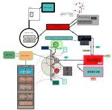

# Minishell Project Documentation
A minimalist Unix shell project aimed at providing a basic command-line interface and shell environment.

<p align="center">

</p>


## Introduction

Minishell is a simple Unix shell implementation, developed as part of the curriculum at 42 School of Perpignan. It provides a command-line interface for users to interact with their operating system, execute commands, and manage processes.

The primary goal of Minishell is to provide a basic understanding of how shells work in Unix-like operating systems, including concepts such as command execution, input/output redirection, pipelines, and job control.

Minishell is designed to be lightweight and portable, making it suitable for educational purposes and as a foundation for learning more about system programming and operating systems.

Whether you're a beginner learning about shells for the first time or an experienced developer looking to explore the internals of shell programming, Minishell provides a simple yet powerful environment for experimenting and learning.

## Features

Minishell comes with a variety of features to enhance your command-line experience. Some of its main features include:

1. **Command Execution**: Execute built-in commands as well as external programs and scripts.

2. **Input/Output Redirection**: Redirect standard input and output streams to and from files.

3. **Pipeline Support**: Create pipelines to chain the output of one command as the input to another.

4. **Environment Variables**: Manage environment variables and access system information.

5. **Built-in Commands**: Minishell supports a variety of built-in commands for common operations such as changing directories (`cd`), listing directory contents (`ls`), and printing environment variables (`env`).

6. **Job Control**: Manage background processes, suspend/resume jobs, and monitor their status.

7. **Command History**: Navigate through previously executed commands using command history functionality.

8. **Tab Completion**: Minishell provides tab completion for commands, file paths, and environment variables to improve productivity.

9. **Customization**: Customize prompt appearance, command aliases, and other shell settings to suit your preferences.

10. **Logical Operators**: Minishell supports logical operators `&&` and `||` for conditional command execution.

11. **Parenthesis**: Use parenthesis to group commands and control their execution order.

12. **Wildcard Support**: Use wildcards (`*`) for pattern matching in command arguments.

With these features, Minishell offers a comprehensive yet lightweight shell environment for your command-line tasks and scripting needs. Whether you're a novice user or an experienced developer, Minishell provides a flexible and powerful platform for interacting with your system.

## Getting Started

To get started with Minishell, follow these simple steps:

1. **Clone the Repository**: Clone the Minishell repository to your local machine using the following command:

   ```bash
   git clone https://github.com/dansylvain/42_minishell minishell
   ```
2. Navigate to the Project Directory: Change your current directory to the Minishell project directory:
```bash
cd minishell
```
3. Compile Minishell: Compile the Minishell source code using the Makefile:
```bash
make
```
4. Run Minishell: Once the compilation is successful, you can run Minishell by executing the compiled binary:
```bash
./minishell
```
5. Start Using Minishell: You are now ready to start using Minishell! You can enter commands, execute scripts, and explore its features.

Congratulations! You have successfully set up and started using Minishell on your system. Have fun exploring its capabilities and experimenting with command-line tasks!<br>
<br>Below is a graphical description outlining the design of the minishell.


*Figure 1: program flow design of Minishell*

## Usage

To use Minishell effectively, follow these guidelines:

1. Entering Commands: Enter commands directly into the Minishell prompt. Press Enter after typing each command to execute it.
2. Executing Programs: Execute external programs and scripts by typing their names followed by any required arguments. For example:
```bash
ls -l
./my_script.sh arg1 arg2
```
3. Built-in Commands: Minishell supports various built-in commands for common operations. Some examples include:
* cd: Change the current directory.
* pwd: Print the current working directory.
* echo: Print arguments to the standard output.
* exit: Exit Minishell.
4. Input/Output Redirection: Redirect standard input and output streams using the following symbols:
* **<**: Redirect standard input from a file.
* **>**: Redirect standard output to a file (overwrite).
* **>>**: Redirect standard output to a file (append).
5. Pipelines: Create pipelines to chain the output of one command as the input to another. Use the | symbol to separate commands in the pipeline.
6. Logical Operators: Use logical operators && and || for conditional command execution. For example:
```bash
command1 && command2    # Execute command2 only if command1 succeeds
command1 || command2    # Execute command2 only if command1 fails
```
7. Parenthesis: Use parenthesis to group commands and control their execution order. For example:
```bash
(command1 && command2) || command3
```
8. Wildcard Support: Minishell supports wildcard character (*) for pattern matching in command arguments.
9. Environment variables support: see below.
10. Tab Completion: Minishell provides tab completion for commands, file paths, and environment variables to improve productivity.
11. Command History: Navigate through previously executed commands using command history functionality. Press the Up and Down arrow keys to scroll through the command history.

By following these usage guidelines, you can make the most of Minishell's features and efficiently perform command-line tasks and scripting operations.

## Built-in Commands

Minishell supports several built-in commands for performing common operations directly within the shell. Here is a list of some built-in commands along with their descriptions and usage:
1. cd: Change the current working directory.
```bash
cd <directory>
```
2. pwd: Print the current working directory.
```bash
pwd
```
3. echo: Print arguments to the standard output.
```bash
echo <message>
```
4. exit: exit Minishell
```bash
exit
```
> [!TIP]
> You can use CTRL + D to exit minishell as well.
5. env: Print environment variables.
```bash
env
```
6. export: Export an environment variable.
```bash
export <variable>
```
7. unset: Unset an environment variable.
```bash
unset <variable>
```
These built-in commands provide convenient shortcuts for performing various operations directly within Minishell without invoking external programs.
## External Commands

In addition to built-in commands, Minishell allows you to execute external commands and programs available in your system. Here's how you can use external commands in Minishell:

1. Execute Programs: Simply type the name of the program or command you want to execute followed by any required arguments.
```bash
./program_name arg1 arg2 ...
```
2. Full Path: If the program is not in the current directory or not included in the system's PATH environment variable, you can specify the full path to the program.
```bash
./path/to/program arg1 arg2 ...
```
3. Using Environment Variables: You can also use environment variables to specify the path to the program.
```bash
$HOME/bin/program arg1 arg2 ...
```

Minishell will search for external commands in directories specified in the PATH environment variable. You can view the current PATH variable by running echo $PATH. Ensure that the directory containing the desired executable is included in the PATH for Minishell to find and execute the command successfully.

## Environment Variables

Minishell allows you to manage environment variables, which are dynamic values that affect the behavior of running processes. Here's how you can work with environment variables in Minishell:

1. **View Environment Variables**: You can view all environment variables currently set in your shell by using the `env` command.
```bash
env
```
2. Set Environment Variables: Use the export command to set or modify environment variables.
```bash
export VARIABLE_NAME=value
```
For example:
```bash
export PATH=/usr/local/bin:$PATH
```
3. Unset Environment Variables: To remove an environment variable, use the unset command followed by the variable name.
```bash
unset VARIABLE_NAME
```
4. Access Environment Variables: You can access the value of an environment variable by prefixing its name with the $ symbol.
```bash
echo $VARIABLE_NAME
```
For example:
```bash
echo $HOME
```
5. Default Environment Variables: Minishell automatically inherits environment variables from its parent process (e.g., the user's shell). Common environment variables include PATH, HOME, USER, SHELL, etc.
6. Customization: You can customize your shell environment by setting additional environment variables to suit your preferences or requirements.
By managing environment variables in Minishell, you can control various aspects of your shell environment and customize it to meet your specific needs.
## Input/Output Redirection

Minishell supports input/output redirection to manipulate data streams. Here's a common usage example:
* Redirecting Output to a File: Use the > symbol to redirect standard output to a file. For example:
```bash
ls -l > directory_contents.txt
```
This command lists the contents of the current directory and saves the output to a file named directory_contents.txt. If the file already exists, its contents will be overwritten.

## Pipelines

Minishell allows you to create pipelines to chain the output of one command as the input to another. Here's a usage example:

* Combining Commands with a Pipeline: Use the | symbol to create a pipeline. For example:
```bash
cat file.txt | grep "pattern"
```
This command reads the contents of file.txt, passes it to grep, and filters lines containing the specified pattern.

## Contact

For questions or inquiries about minishell, you can reach out to:<br>

Seb - [email](svidot@student.42perpignan.fr)<br>
Dan - [email](dsylvain@student.42perpignan.fr)<br><br>

Enjoy minishell! 🚀
